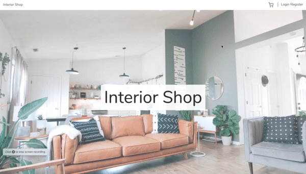

# Interior-Shop
Interior-Shop is a shop platform for designers to sell their creations.

The project was time-framed for a weekend to have to have a look into the Laravel PHP framework.

 

## Run the application
Clone the project and run
```
docker-compose up
```
Access http://localhost:8000 in your browser

To rebuild the interior-shop image construction run
```
docker-compose up --build
```

## Features
The application supports the following features, divided into the sellers (login) and visitors (not logged in).
### Sellers
* Sign Up and Login
* Add products
* Edit products
* See orders

### Visitors & Sellers
* See all products
* Put products into shopping cart
* Order everything that is in the shopping cart

## Upcoming features
* Order API microservice implemented with the light-weight Laravel Lumen framework
* Product API implemented into the already existing application

## Run the application

```
docker-compose up
```
Access http://localhost:8000 in your browser

To rebuild the interior-shop image construction run
```
docker-compose up --build
```
